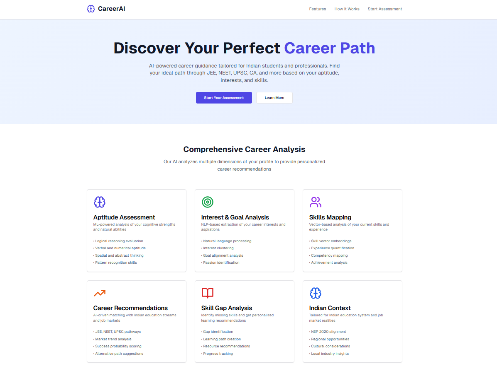
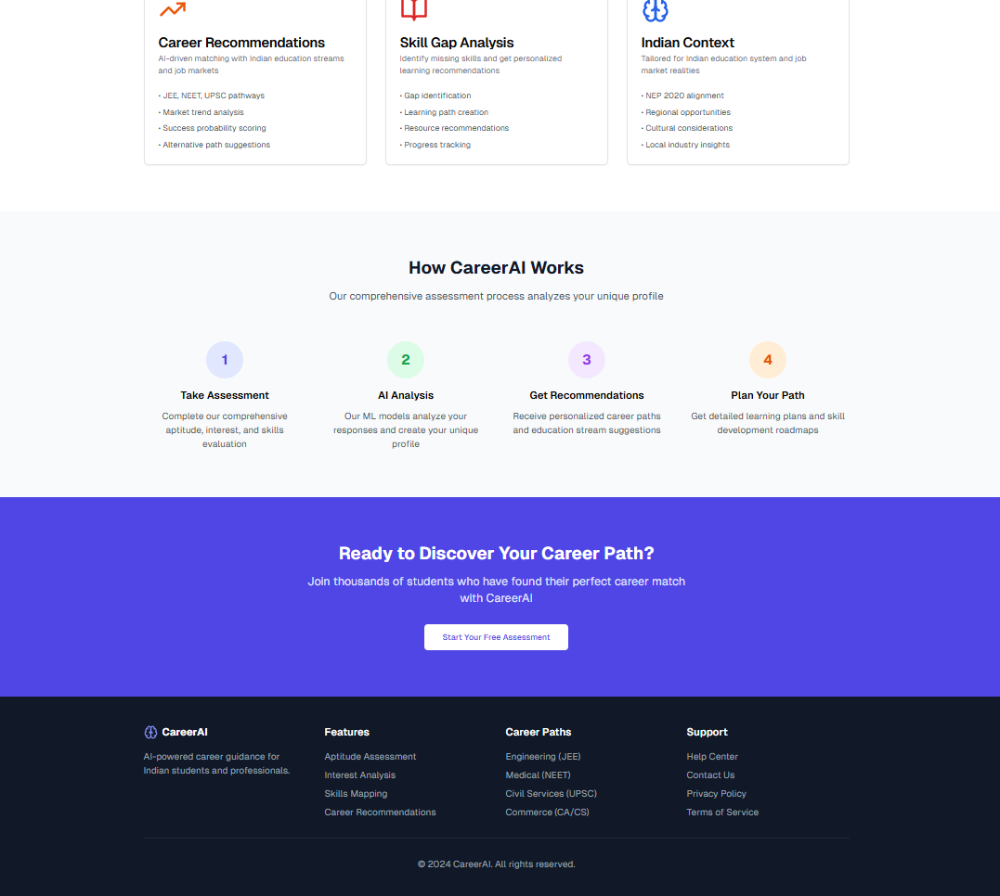

# 🧠 CareerAI - AI-Driven Career Guidance Platform

An intelligent career guidance platform specifically designed for Indian students and young professionals. CareerAI uses advanced AI algorithms to analyze aptitude, interests, and skills to provide personalized career recommendations aligned with Indian education streams like JEE, NEET, UPSC, CA, and more.




## 🎯 Overview

CareerAI addresses the critical need for personalized career guidance in India's complex education landscape. By combining machine learning, natural language processing, and comprehensive assessment techniques, the platform helps users discover their ideal career paths based on scientific analysis rather than guesswork.

### 🌟 Key Features

- **🧠 AI-Powered Aptitude Assessment** - ML-based cognitive ability evaluation
- **🎯 NLP Interest Analysis** - Natural language processing for goal extraction
- **💼 Skills Mapping** - Vector-based skill profiling and experience analysis
- **🎓 Indian Education Focus** - Tailored for JEE, NEET, UPSC, CA, and other streams
- **📊 Comprehensive Analytics** - Detailed reports with actionable insights
- **🛤️ Personalized Learning Paths** - Custom skill development roadmaps

## 🏗️ Architecture & Technology Stack

### Frontend
- **Framework**: Next.js 14 with App Router
- **UI Library**: shadcn/ui + Tailwind CSS
- **Icons**: Lucide React
- **State Management**: React Hooks
- **Responsive Design**: Mobile-first approach

### AI/ML Components (Simulated)
- **Aptitude Analysis**: Multi-dimensional cognitive assessment
- **NLP Processing**: Text analysis for interest extraction
- **Recommendation Engine**: Cosine similarity-based matching
- **Skill Vectorization**: Embedding-based skill mapping

### Core Modules
```
+-- Aptitude Estimation (ML Models)
+-- NLP-Based Goal & Interest Extraction
+-- Skill & Experience Mapping
+-- AI-Based Recommendation Engine
`-- Skill Gap Analyzer
```

## 🚀 Getting Started

### Prerequisites
- Node.js 18+ 
- npm or yarn package manager

### Installation

1. **Clone the repository**
\`\`\`bash
git clone https://github.com/RohitNunnaguppala/ai-career-guidance-engine.git
cd career-ai-platform
\`\`\`

2. **Install dependencies**
\`\`\`bash
npm install
# or
yarn install
\`\`\`

3. **Run the development server**
\`\`\`bash
npm run dev
# or
yarn dev
\`\`\`

4. **Open your browser**
Navigate to `http://localhost:3000` to see the application.

## 📱 User Journey & Screenshots

### 1. Landing Page

*Modern, responsive landing page showcasing platform features and benefits*

### 2. Assessment Overview

*Comprehensive overview of the multi-step assessment process*

### 3. Aptitude Test Interface

*Interactive aptitude assessment with real-time progress tracking*

### 4. Interest Analysis

*NLP-powered text analysis for extracting career interests and goals*

### 5. Skills Assessment

*Comprehensive skills mapping with proficiency rating system*

### 6. Results Dashboard

*Detailed analytics dashboard with personalized insights*

### 7. Career Recommendations

*AI-powered career matching with Indian education streams*

### 8. Skill Gap Analysis

*Personalized learning paths and skill development recommendations*

## 🔧 Core Modules Explained

### 1. Aptitude Estimation Module
**Purpose**: Evaluate cognitive abilities and natural strengths
- **Input**: Quiz responses, behavioral data
- **Processing**: Multi-dimensional analysis (logical, numerical, verbal, spatial)
- **Output**: Cognitive profile with strength indicators
- **Technology**: Simulated ML classification algorithms

### 2. NLP Interest Analysis
**Purpose**: Extract career interests from natural language input
- **Input**: Free-text descriptions of interests and goals
- **Processing**: Keyword extraction, sentiment analysis, categorization
- **Output**: Interest clusters and preference rankings
- **Technology**: Simulated NLP with pattern matching

### 3. Skills & Experience Mapping
**Purpose**: Create comprehensive skill profiles
- **Input**: Skill selections, proficiency ratings, experience data
- **Processing**: Vector embedding generation, competency mapping
- **Output**: Skill vectors matched with career requirements
- **Technology**: Similarity-based matching algorithms

### 4. AI Recommendation Engine
**Purpose**: Match user profiles with optimal career paths
- **Input**: Combined aptitude, interest, and skill data
- **Processing**: Multi-factor analysis with weighted scoring
- **Output**: Ranked career recommendations with match percentages
- **Technology**: Cosine similarity and decision tree logic

### 5. Skill Gap Analyzer
**Purpose**: Identify development areas and create learning paths
- **Input**: Current skills vs. target career requirements
- **Processing**: Gap analysis and resource mapping
- **Output**: Personalized learning roadmaps
- **Technology**: Rule-based recommendation system

## 🎓 Indian Education Integration

### Supported Career Streams
- **Engineering**: JEE Main, JEE Advanced, BITSAT, State CETs
- **Medical**: NEET UG, AIIMS, JIPMER
- **Civil Services**: UPSC CSE, State PSCs
- **Commerce**: CA, CS, CMA
- **Design**: NATA, NID, CEED
- **Law**: CLAT, AILET
- **Management**: CAT, XAT, MAT

### Assessment Alignment
- **NEP 2020 Compliance**: Aligned with National Education Policy
- **Regional Considerations**: State-specific opportunities
- **Cultural Context**: Indian work environment preferences
- **Market Trends**: Current job market analysis

## 📊 Features Deep Dive

### Comprehensive Assessment Flow
1. **Multi-step Process**: Guided assessment across all modules
2. **Progress Tracking**: Real-time completion indicators
3. **Adaptive Questions**: Dynamic question selection
4. **Time Management**: Built-in timers and pacing

### Advanced Analytics
- **Cognitive Profiling**: Detailed aptitude breakdown
- **Interest Mapping**: Visual interest distribution
- **Skill Visualization**: Competency radar charts
- **Career Matching**: Compatibility scoring

### Personalization Engine
- **Individual Profiles**: Unique user characteristics
- **Custom Recommendations**: Tailored career suggestions
- **Learning Paths**: Personalized development plans
- **Progress Tracking**: Skill development monitoring

## 🛠️ Development & Customization

### Project Structure
\`\`\`
├── app/                    # Next.js app directory
│   ├── page.tsx           # Landing page
│   ├── assessment/        # Assessment flow
│   └── layout.tsx         # Root layout
├── components/            # React components
│   ├── ui/               # shadcn/ui components
│   ├── aptitude-test.tsx # Aptitude assessment
│   ├── interest-analysis.tsx # Interest evaluation
│   ├── skills-assessment.tsx # Skills mapping
│   └── results-dashboard.tsx # Results display
├── lib/                  # Utility functions
└── public/              # Static assets
\`\`\`

### Key Components
- **Assessment Flow**: Multi-step guided process
- **ML Simulation**: Algorithms demonstrating AI concepts
- **Data Processing**: User input analysis and scoring
- **Visualization**: Charts and progress indicators

### Customization Options
- **Question Banks**: Expandable assessment questions
- **Career Database**: Customizable career information
- **Scoring Algorithms**: Adjustable weighting factors
- **UI Themes**: Customizable design system

## 🔮 Future Enhancements

### Phase 1: Core ML Integration
- [ ] Real scikit-learn model implementation
- [ ] Advanced NLP with BERT/spaCy
- [ ] Database integration for user profiles
- [ ] Enhanced recommendation algorithms

### Phase 2: Advanced Features
- [ ] Real-time career market data
- [ ] Video-based assessments
- [ ] Peer comparison analytics
- [ ] Mentor matching system

### Phase 3: Scale & Integration
- [ ] Mobile application
- [ ] Institution partnerships
- [ ] API for third-party integration
- [ ] Advanced reporting dashboard

## 📈 Impact & Benefits

### For Students
- **Informed Decisions**: Data-driven career choices
- **Personalized Guidance**: Tailored recommendations
- **Skill Development**: Clear learning pathways
- **Confidence Building**: Scientific validation of choices

### For Educators
- **Student Insights**: Comprehensive student profiles
- **Curriculum Alignment**: Skills-based program design
- **Career Counseling**: Enhanced guidance capabilities
- **Progress Tracking**: Student development monitoring

### For Institutions
- **Placement Success**: Better career-student matching
- **Program Optimization**: Data-driven curriculum design
- **Student Satisfaction**: Improved career outcomes
- **Market Alignment**: Industry-relevant skill development

## 🤝 Contributing

We welcome contributions to improve CareerAI! Here's how you can help:

1. **Fork the repository**
2. **Create a feature branch** (`git checkout -b feature/amazing-feature`)
3. **Commit your changes** (`git commit -m 'Add amazing feature'`)
4. **Push to the branch** (`git push origin feature/amazing-feature`)
5. **Open a Pull Request**

### Contribution Areas
- **ML Model Enhancement**: Improve recommendation algorithms
- **UI/UX Improvements**: Better user experience design
- **Career Database**: Expand career information
- **Assessment Questions**: Add more evaluation content
- **Documentation**: Improve guides and tutorials

## 📄 License

This project is licensed under the MIT License - see the [LICENSE](LICENSE) file for details.

## 🙏 Acknowledgments

- **Indian Education System**: Inspired by the complexity and diversity of Indian career paths
- **Open Source Community**: Built with amazing open-source tools and libraries
- **Career Counselors**: Insights from professional career guidance experts
- **Students & Educators**: Feedback from the target user community

## 📞 Support & Contact

- **Documentation**: [Wiki](https://github.com/yourusername/career-ai-platform/wiki)
- **Issues**: [GitHub Issues](https://github.com/yourusername/career-ai-platform/issues)
- **Discussions**: [GitHub Discussions](https://github.com/yourusername/career-ai-platform/discussions)
- **Email**: support@careerai.com

---

**Made with ❤️ for Indian students and professionals**

*Empowering career decisions through artificial intelligence*
